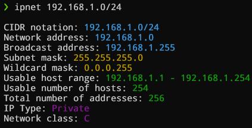

# IPnet

IPnet is a command-line tool for IP subnet calculation and displaying network information. Whether you need an IP calculator this tool will do the job easily.

## Table of Contents
- [Features](#features)
- [Usage](#usage)
- [Examples](#examples)
- [Demo](#demo)
- [Requirements](#requirements)
- [Installation](#installation)
- [Why IPnet? A Comparison with ipcalc](#why-ipnet-a-comparison-with-ipcalc)
- [Changelog](#changelog)
- [Contributing](#contributing)
- [License](#license)

## Features

- Calculate network information from an IP address in CIDR notation, or an IP address with a subnet or wildcard mask.
- Displays the following information, example below:

  

## Usage

```bash
ipnet <IP> [Mask]
```
## Examples

```bash
ipnet 192.168.1.0/24
ipnet 192.168.1.0 255.255.255.0
ipnet 192.168.1.0 0.0.15.255
```

## Demo


## Requirements
* Python 3.6 or higher

## Installation
To install IPnet CLI tool, follow these steps:

1. Clone the repository:
```bash
git clone https://github.com/nicanorflavier/ipnet.git
```
2. Navigate to the directory:
```bash
cd ipnet
```
3. Install the package:
```bash
pip install .
```
4. Start using it from your cli
```bash
ipnet <IP> [MASK]
```
Or you can download the release binaries for Windows and Ubuntu and run it directly.

## Why IPnet? A Comparison with ipcalc

You might be thinking, "Why should I use IPnet when I already have ipcalc?" Well, let's talk about that.

First off, ipcalc is a fantastic tool, no doubt about it. It's available in most distributions and provides a wealth of information. But it's written in Perl. Now, there's nothing wrong with Perl, but if you're working in a Python-centric environment or you're a Python developer, IPnet will feel more at home in your workflow. It's written in Python, which means you can easily extend it, modify it, or integrate it into your Python projects. 

Secondly, ipcalc does provide a lot of information, including binary representations by default. But sometimes, you just need the basics. You need to get in, get the info, and get out. That's where IPnet shines. It focuses on providing the essential network information in a simple, easy-to-understand format. No frills, no unnecessary complexity, just the network info you need when you need it.

So, if you're looking for a tool that's Python-based, simple, and straightforward for quick network information, give IPnet a try.

## Changelog
See the [CHANGELOG.md](CHANGELOG.md) file for details about what has changed in each release of IPnet.

## Contributing
We welcome contributions from the community.
* Please raise a new issue if you find any bugs or any feature request you want.
* To submit a change, please fork the repository or create a new branch and submit your pull request.

## License
This project is distributed under the GNU General Public License (GPL) v3.0 License. See LICENSE.txt for more information.
